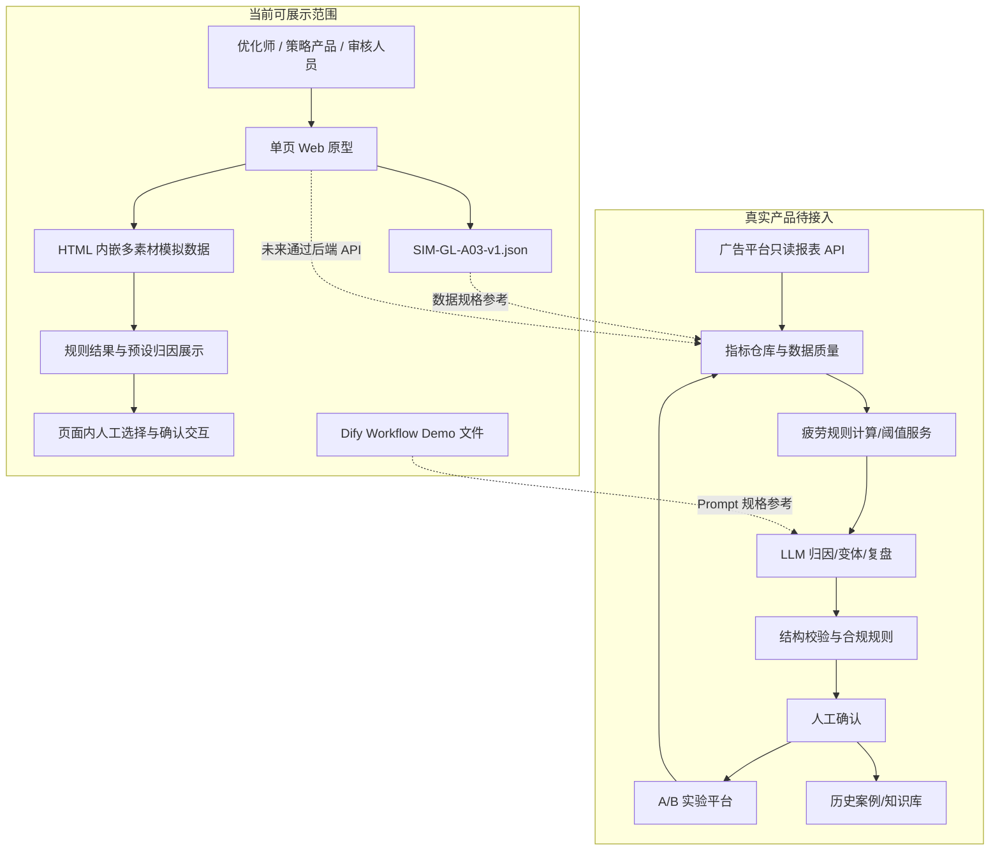
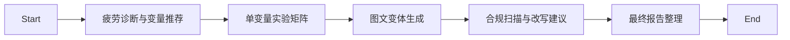
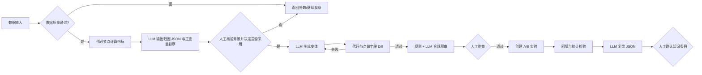

# 04 产品架构与 Workflow

## 1. 架构结论

当前项目是一个**可交互静态 Web 原型 + 模拟数据 + Dify Workflow Demo + 产品方案**，不是已上线系统。最合理的架构表达是把已实现层与待接入层分开。

## 2. 各层说明

### 2.1 前端页面

**已实现**：`web/index.html`。

- 疲劳诊断中心：素材筛选、CTR 衰减、疲劳分、归因时间线和主变量建议。
- 智能续命工作台：变量选择、实验参数、对照/变体、手机预览、合规详情。
- 复盘看板：模拟结果、商业指标占位、事实/推测分层、知识条目候选。
- 技术形态：原生 HTML/CSS/JavaScript，不需要构建。

**未实现**：登录、权限、后端、数据库、真实 API、异步任务、审计日志。

### 2.2 模拟数据

- `assets/data/SIM-GL-A03-v1.json`：课程 Demo 的统一样例，包含 Campaign Brief、8 条素材、权重框架、实验分组、合规预审和复盘条目。
- 页面还内嵌了美妆、3C、食品、教育等更多示例；当前没有从 JSON 动态加载，因此存在两个数据源。
- 优化页新增的 CVR、消耗和 ROI 快照为明确标注的模拟/接口占位。

### 2.3 规则计算

**已有方案**：权重框架、阈值、高/中/健康分层、低疲劳守卫、统一实验窗口。

**实际代码**：主要读取预设疲劳分和硬编码数据；部分统计为前端聚合，复盘 uplift 使用固定倍率生成。

**缺口**：归一化函数、缺失值处理、数据质量、阈值校准、置信区间、显著性检验没有实现。

### 2.4 LLM 节点

现有 Dify 文件包含 5 个串行 LLM 节点；Web 页面未调用它们。下一版应让规则/代码节点做事实计算和结构校验，由 LLM 输出主变量排序、归因假设和候选。

### 2.5 用户确认节点

当前页面已有选择素材、选择变体和提交实验等交互，但不是真实后端审批。产品方案中应设置：

1. AI 输出主变量排序后，优化师核验业务背景并决定是否采用该实验方向。
2. 变体生成后确认候选与品牌调性。
3. 合规预审后由审核/法务终审。
4. 实验后确认放量/停投。
5. 复盘后确认知识条目是否写入。

### 2.6 实验数据回流

当前是页面模拟。真实产品需要回流：实验 ID、素材/版本 ID、分流、时间窗口、曝光、点击、转化、消耗、频次、收益、数据质量、统计结果和异常事件。

### 2.7 历史案例与知识库

可扩展位置：

- `creative_cases`：素材内容、行业、人群、平台、生命周期、指标轨迹。
- `experiment_learnings`：假设、变量、固定项、结果、适用条件、失效条件。
- `compliance_rules`：规则版本、风险原句、依据、人工结果。
- `prompt_runs`：Prompt/模型版本、输入输出、人工修改、最终采纳。

知识库只保存人工确认后的条目；失败和无结论实验也要保留，避免幸存者偏差。

## 3. 现有 Dify Workflow 读取结果

文件：`workflow/创意续命实验台_Dify工作流Demo.yml`

### 3.1 输入

Start 节点接收三个段落变量：

- `campaign_brief`
- `history_materials`
- `compliance_rules`

### 3.2 节点链路

| 节点 | 现有 Prompt 作用 | 温度 | 输出 | 真实性状态 |
|---|---|---:|---|---|
| 疲劳诊断与变量推荐 | 基于历史素材给出演示级诊断，选一个主变量 | 0.25 | Markdown 文本 | Dify 定义存在，未与 Web 打通 |
| 单变量实验矩阵 | 生成 A/B/C/D 组与固定项 | 0.25 | Markdown 文本 | Dify 定义存在 |
| 图文变体生成 | 生成 4 组图文方案 | 0.55 | Markdown 文本 | Dify 定义存在 |
| 合规扫描与改写建议 | 输出风险、原因和建议改写 | 0.20 | Markdown 文本 | Dify 定义存在 |
| 最终报告整理 | 汇总前四个节点 | 0.25 | Markdown 文本 | 是报告整理，不等于真实实验复盘 |

YML 指定 `gpt-4o-mini` 和 OpenAI marketplace provider，但文件中没有 API Key；运行需要在 Dify 环境单独配置模型权限。

### 3.3 现有 Workflow 的优点

- 明确写出“课堂 Demo、不接真实广告平台、不预测真实 CTR/CVR”。
- 顺序符合诊断后生成、生成后合规的产品逻辑。
- 变体节点强调对照组和单变量。

### 3.4 现有 Workflow 的不足

- 全部是串行 LLM 文本节点，没有规则计算、代码、条件分支或人工确认节点。
- 输出为 Markdown，缺少 JSON Schema、字段校验和固定项 diff。
- 没有数据质量、异常重试、模型失败兜底和风险硬拦截。
- “最终报告”汇总生成内容，没有接收真实实验结果，不应包装成实验复盘能力。
- 没有知识库、实验平台或广告平台接口。

## 4. 推荐的最小可落地 Workflow

这个版本不需要复杂 Agent。规则节点、四个 LLM 节点、三个高影响人工决策点和两个外部接口已经足以体现产品化设计。

## 5. 数据契约建议

### 诊断输入最小字段

`account_id`、`campaign_id`、`creative_id`、`window_start/end`、`impressions`、`clicks`、`conversions`、`spend`、`revenue`、`reach`、`status`、`data_quality`。

### 实验回流最小字段

`experiment_id`、`group_id`、`allocation`、`start/end`、`impressions`、`clicks`、`conversions`、`spend`、`revenue`、`frequency`、`stat_test`、`guardrail_status`。

### 审计字段

`rule_version`、`prompt_version`、`model_version`、`operator_id`、`human_decision`、`decision_time`、`reason`。

## 6. 权限与风险

- 广告账户数据按账户/组织隔离，只读接入优先。
- 预算和投放动作不由当前 LLM 直接执行。
- 素材、品牌 Brief 和用户评论需做权限、脱敏与留存周期管理。
- 合规规则需要版本化，模型结论保留依据与人工结果。
