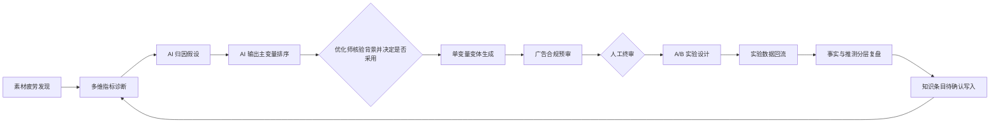
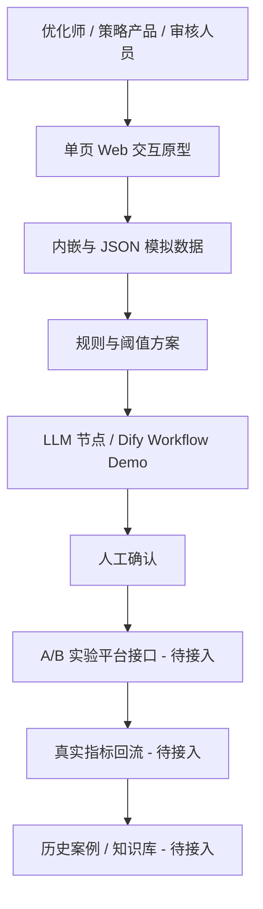
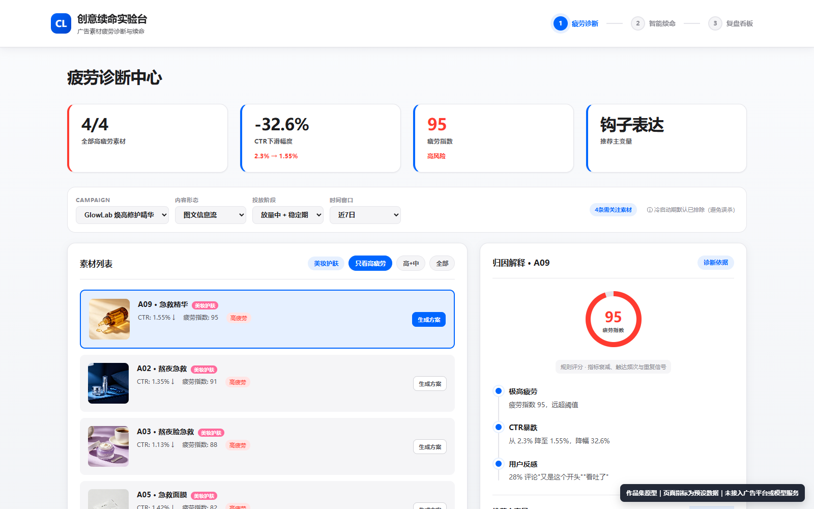
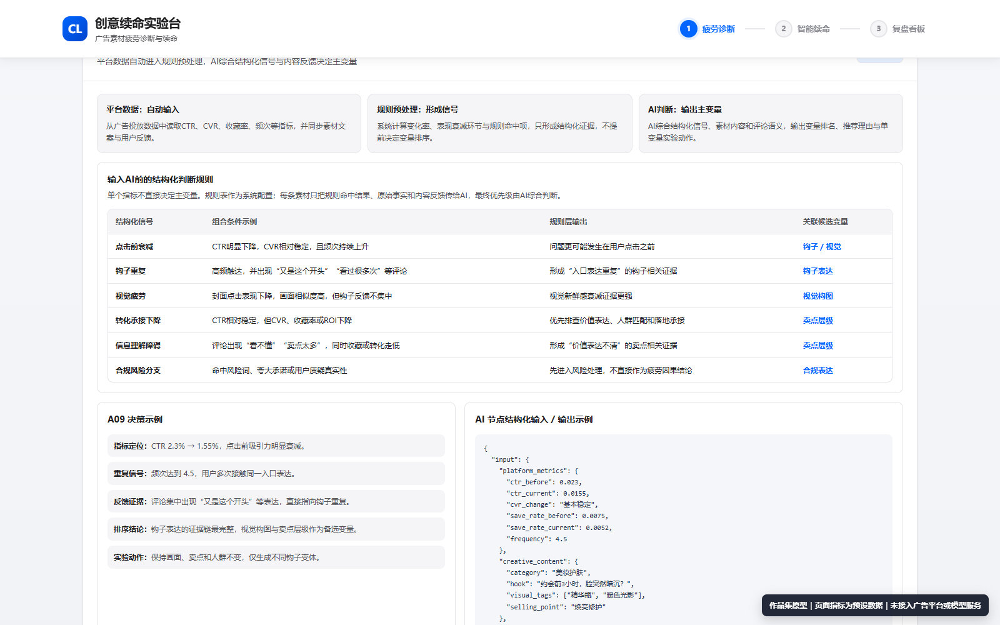
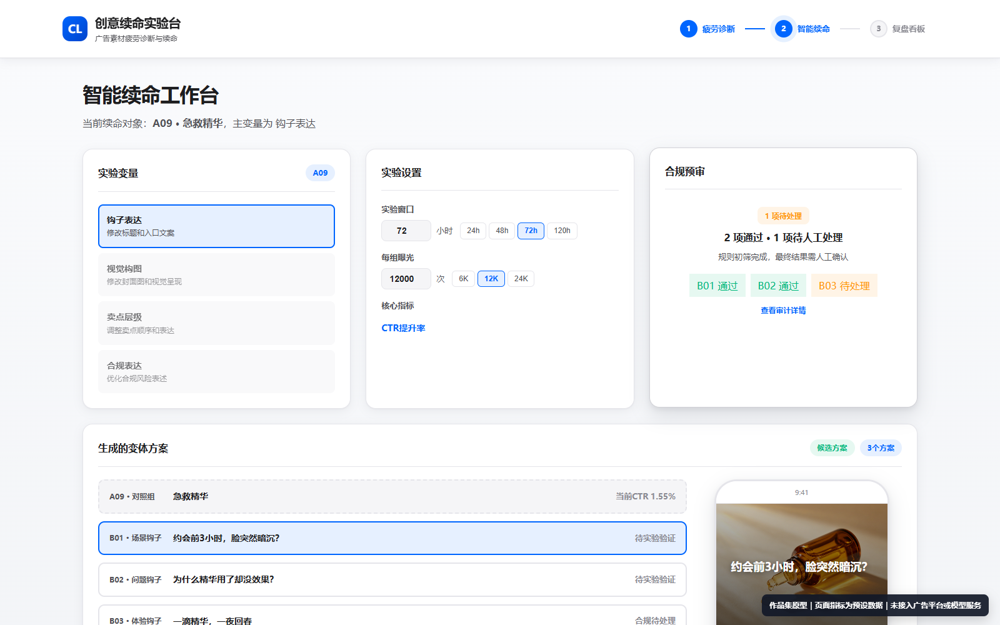
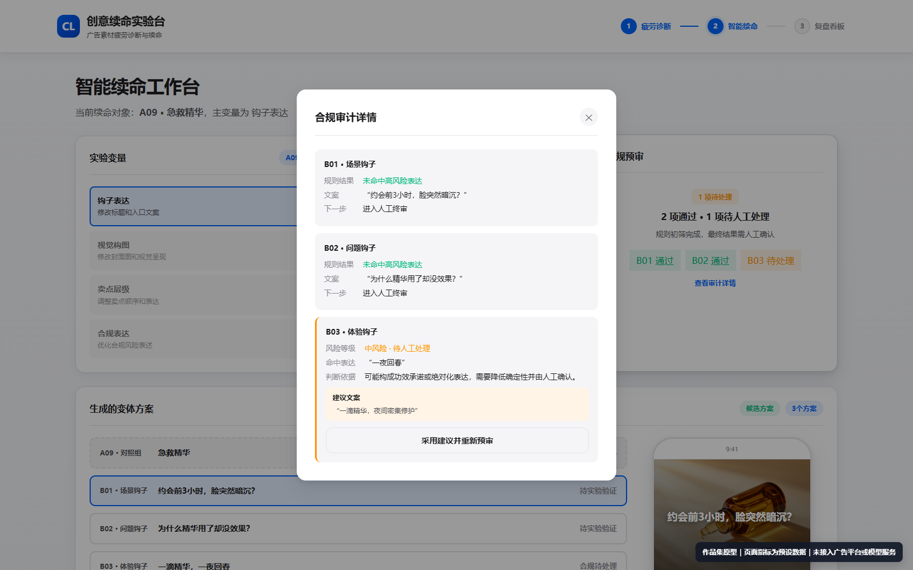
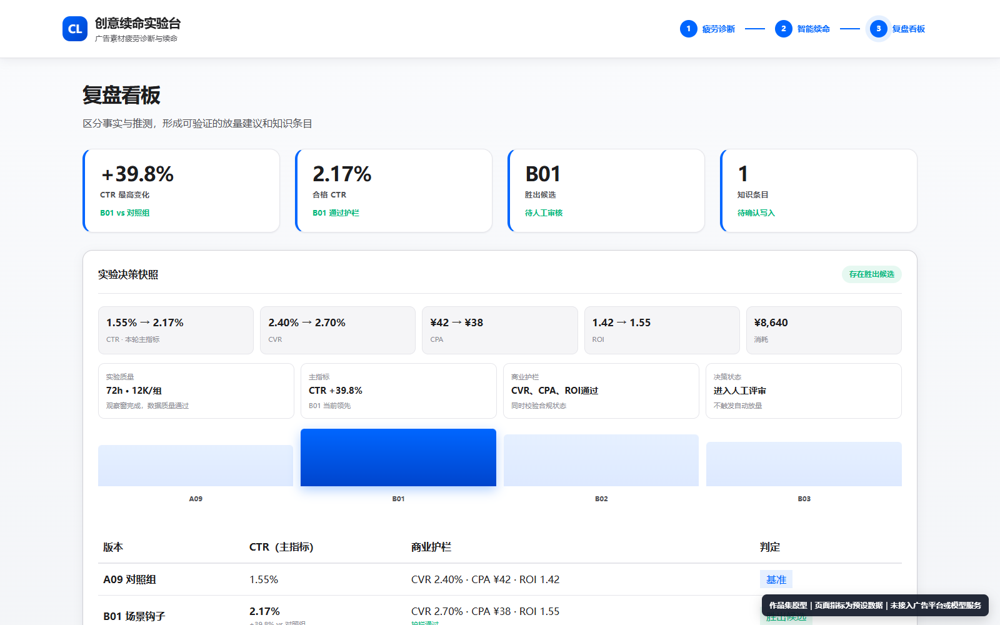
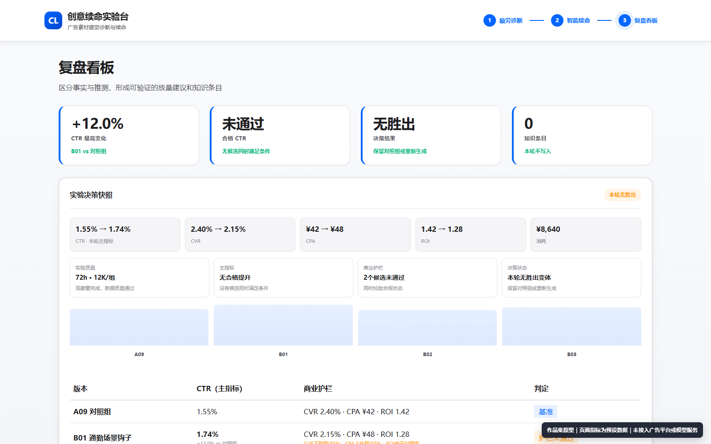

# 创意续命实验台

> AI 驱动的广告素材疲劳诊断与续命产品原型

创意续命实验台面向品牌投放团队、代理商优化师和商业化策略产品经理，尝试把“素材表现下滑后凭经验重做”的过程，转化为一个可解释、可验证、可沉淀的产品闭环：**发现疲劳 → 多维指标诊断 → AI 归因 → 单变量变体 → 合规预审 → A/B 实验 → 复盘与知识沉淀**。

> 真实性说明：本项目是课程/作品集原型。页面中的广告素材、CTR、CVR、消耗、频次、ROI、疲劳分和实验结果均为模拟或预设数据；Web 原型未接入真实广告平台、LLM API、审核系统或知识库。Dify 文件是可阅读的 Workflow Demo 定义，不代表线上服务。

## 1. 为什么做这个项目

信息流素材进入衰退期后，团队常遇到四个问题：发现晚、归因靠经验、重做时同时修改多个要素、生成后才发现合规风险。结果是制作成本上升、实验不可归因、有效经验难以复用。

本项目不追求“让模型批量生成更多素材”，而是把 AI 放在需要语言理解和候选生成的位置，把指标计算、实验约束和关键决策留给规则与人。

## 2. 目标用户

- 品牌方或代理商的信息流广告优化师：定位衰退素材并形成下一步动作。
- 创意策略/内容运营：基于主变量生成可比较候选，减少无效大改。
- 广告产品/商业化策略产品经理：配置疲劳阈值、实验口径、合规规则和回流机制。
- 审核与法务协作角色：查看风险原句、依据和改写建议，完成最终确认。

## 3. 产品目标

1. 用 CTR/CVR、消耗、曝光频次、ROI 与素材生命周期信号更早发现疲劳。
2. 将规则证据与 AI 归因假设分开展示，提高可解释性。
3. 一轮只改变一个主变量，保证 A/B 结果可比较。
4. 在实验前完成合规预审，并保留人工终审。
5. 把实验事实、适用条件与失败案例沉淀为下一轮诊断输入。

## 4. 核心业务流程



## 5. 产品功能模块

### 5.1 疲劳诊断中心

- 以素材为单位查看 CTR 衰减、收藏率、频次、评论重复信号和疲劳等级。
- 规则层提供可核验指标；归因层输出“为什么可能疲劳”的假设。
- 对健康或中疲劳素材设置守卫，不默认进入续命流程。

### 5.2 智能续命工作台

- 锁定钩子、视觉、卖点层级或合规表达中的一个主变量。
- 显示对照组与三个候选变体，明确固定项和变化项。
- 配置实验窗口、每组曝光和主指标；关键动作由人确认。

### 5.3 合规预审

- 展示风险句、风险类型、风险等级和改写建议。
- 预审只用于筛查，不替代平台审核、法务或人工终审。

### 5.4 实验复盘

- 对比对照组与变体组，演示 CTR/CVR、消耗、频次和 ROI 的回填位置。
- 将“回填事实”和“模型/产品推测”分栏，避免把相关性写成因果。
- 生成放量建议、知识条目和合规规则候选，但不自动执行。

## 6. AI 能力设计

| 节点 | AI 的职责 | 规则/系统职责 | 人的职责 | 当前状态 |
|---|---|---|---|---|
| 疲劳归因 | 解释结构化信号，输出主变量排序与归因假设 | 指标口径、阈值、事实信号和确定性约束 | 核验业务背景，决定是否采用该实验方向 | Dify Prompt Demo + 页面预设 |
| 变体生成 | 生成指定变量的候选表达 | 对照组冻结、差异校验 | 选择/编辑候选 | 页面预设 + Dify Prompt Demo |
| 合规预审 | 识别风险句并解释依据 | 规则库、敏感词和高风险硬拦截 | 审核与放行 | 页面模拟 + Dify Prompt Demo |
| 实验复盘 | 汇总回填事实，生成待验证结论 | 指标计算、显著性和护栏检查 | 决定放量与是否沉淀 | 产品方案；页面模拟展示 |

详细 Prompt、结构化输出与兜底见 [02_AI节点与Prompt说明.md](02_AI节点与Prompt说明.md)。

## 7. 数据与商业指标

- 诊断指标：CTR 相对衰减、CVR 变化、消耗、曝光频次、评论重复/负面信号、素材生命周期。
- 效率指标：CPA、CPM/eCPM、ROI。
- 产品指标：变体采纳率、实验胜出率、人工修改率、知识条目复用率。
- 当前数据：`assets/data/SIM-GL-A03-v1.json` 为统一模拟数据；页面中的部分跨行业素材和复盘数值直接预设在 HTML 中。
- 当前疲劳分：JSON 中保存了权重框架和预设分数，但 Web 代码没有从原始指标实时计算 88 分；不能把该分数描述为已校准模型输出。

完整指标口径与状态见 [03_指标与Evaluation方案.md](03_指标与Evaluation方案.md)。

## 8. Evaluation 方案

AI 评测分为三层：

1. **离线集**：由优化师/审核人员标注疲劳主因、可接受解释、允许修改变量和合规风险。
2. **节点级评测**：归因准确率、解释可接受率、单变量遵循率、事实保留率、合规召回率/误报率、复盘事实一致性。
3. **在线/人工评估**：人工修改率、候选采纳率、实验胜出率，以及业务护栏指标。

当前项目只完成评测方案设计，尚无真实标注集、基准结果或线上评测数据。

## 9. 产品与技术架构



- 前端：单文件 HTML + 原生 CSS/JavaScript，无构建依赖。
- 数据：模拟 JSON 与页面内嵌数据。
- Workflow：Dify DSL，串联 5 个 LLM 节点；未与 Web 原型打通。
- 待接入：广告平台 API、模型服务、实验分流、指标仓库、知识库与权限审计。
- 历史 PRD：`source_docs/` 仅用于追溯课程阶段需求，不代表当前实现或当前责任分工。

## 10. 项目截图

以下 7 张截图均来自 2026-07-19 最新本地原型。截图右下角的真实性说明为拍摄时临时加入的展示水印，不属于页面业务功能。

### 疲劳诊断工作台



### AI 主变量排序与人工继续决策



### 单变量续命工作台



### 单变量候选与固定项


### 合规预审风险与改写



### 实验复盘：胜出候选



### 实验复盘：无胜出分支



截图用途与演示顺序见 [07_展示截图清单.md](07_展示截图清单.md)。
## 11. 当前实现范围

| 能力 | 状态 | 说明 |
|---|---|---|
| 三阶段可交互 Web 页面 | 可运行原型 | 可筛选素材、切换流程、查看变体/合规/复盘状态 |
| 统一模拟数据样例 | 已提供 | JSON + 页面内嵌数据，不是广告平台导出 |
| 疲劳指数实时计算 | 未实现 | 权重与预设分数存在，实时归一化和校准未实现 |
| LLM 动态调用 | 未实现 | Dify DSL 中有 Prompt，Web 无 API 调用 |
| 合规预审 | 模拟 | 页面按预设规则展示，非真实审核服务 |
| A/B 分流与显著性 | 未实现 | 只展示实验配置与模拟结果 |
| 知识库自动写回 | 未实现 | 优化版改为“候选条目，待人工确认” |
| 真实广告平台接入 | 未实现 | 仅有接口和数据产品方案 |

## 12. 本地运行

无需安装依赖。可直接打开 `web/index.html`；为避免浏览器对本地资源的限制，也可使用 Node.js：

```bash
node server.js
```

然后访问 `http://localhost:8080/`。`server.js` 仅提供静态文件服务，不连接外部网络或模型。

## 13. 后续迭代

1. 先接入只读广告报表 API，完成数据字典、延迟和缺失值监控。
2. 把疲劳分从预设值升级为可解释的规则基线，并用历史标注做阈值校准。
3. 将 Dify 文本输出升级为 JSON Schema，并增加单变量差异校验与重试节点。
4. 建立合规高风险硬拦截、低风险人审和规则版本追踪。
5. 接入真实实验分流、显著性检验和 ROI/CPA 护栏，再讨论自动放量。

## 14. 我的工作与能力体现

- 从广告素材生命周期和商业指标出发，定义用户痛点、核心流程、边界与验收口径。
- 设计“规则形成事实信号与约束 + AI 输出主变量排序、归因假设和候选 + 人工核验业务背景并决定是否继续”的 AI 产品分工。
- 设计单变量实验、合规前置、复盘回流和 Evaluation 方案。
- 输出 PRD、Dify Workflow Demo、模拟数据、交互原型与路演/求职材料。
- 前端实现过程中使用 AI 编码工具辅助生成与调试；产品逻辑、约束、真实性边界和验收由本人负责。面试中不应包装为独立完成真实商业系统。

## 15. 导航

- [01_项目资产盘点.md](01_项目资产盘点.md)
- [02_AI节点与Prompt说明.md](02_AI节点与Prompt说明.md)
- [03_指标与Evaluation方案.md](03_指标与Evaluation方案.md)
- [04_产品架构与Workflow.md](04_产品架构与Workflow.md)
- [07_展示截图清单.md](07_展示截图清单.md)
- [08_阶段性成果与继续优化决策.md](08_阶段性成果与继续优化决策.md)
- [CHANGELOG.md](CHANGELOG.md)
- [项目文件索引.md](项目文件索引.md)
